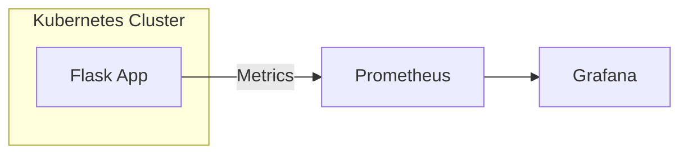

# Kubernetes Observability Stack

An end-to-end monitoring pipeline built with **Flask**, **Prometheus**, and **Grafana** on a local Kubernetes cluster. This project demonstrates how to instrument a Python application, containerize it, and deploy it to a Kubernetes cluster for real-time observability.

---

## 🚀 Overview

The system captures custom metrics from a Flask application and exposes them to Prometheus. Metrics include request counts and active request gauges.



---

## 🛠 Tech Stack

| Layer | Technology |
| :--- | :--- |
| **Application** | Python 3.9 / Flask / Gunicorn |
| **Metrics** | `prometheus_client` (Counter, Gauge) |
| **Containerization** | Docker |
| **Orchestration** | Kubernetes (kind / minikube) |
| **Monitoring** | Prometheus Operator (ServiceMonitor) |
| **Visualization** | Grafana |

---

## 📋 Prerequisites (Mandatory)

To run this project, ensure you have the following installed:

1.  **Docker**: For building and running containers.
2.  **Kubernetes Cluster**: Use `kind`, `minikube`, or a cloud provider.
3.  **kubectl**: The Kubernetes command-line tool.
4.  **Helm**: For installing the Prometheus/Grafana stack.

---

## 🏗 Setup & Deployment (Mandatory)

### 1. Build Docker Image

Build the container image using the provided `Dockerfile`.

```bash
docker build -t prometheus-app:latest .
```

If using `kind`, load the image into your cluster:
```bash
kind load docker-image prometheus-app:latest
```

### 2. Deploy to Kubernetes

Apply the Kubernetes manifests in the following order:

```bash
# 1. Deploy the Application
kubectl apply -f deployment.yaml

# 2. Expose the Application Service
kubectl apply -f service.yaml

# 3. Configure Prometheus Scraping
# Note: Requires Prometheus Operator installed in the 'monitoring' namespace
kubectl apply -f serviceMonitor.yaml
```

### 3. Verify Deployment

Check the status of your pods and services:

```bash
kubectl get pods -l app=prometheus-app
kubectl get svc prometheus-app
```

---

## 📊 Monitoring

### Accessing Metrics

The Flask application exposes metrics at the `/metrics` endpoint. You can port-forward to see them locally:

```bash
kubectl port-forward svc/prometheus-app 5000:5000
```
Visit `http://localhost:5000/metrics` to see the raw Prometheus data.

### Key Metrics Tracked

-   `http_requests_total`: Total number of HTTP requests (Counter).
-   `active_requests`: Currently active requests (Gauge).

### Architecture Insight

> [!TIP]
> **Prometheus Service Discovery**: Prometheus does not scrape pods directly. It discovers Services via `ServiceMonitor`, then resolves each pod endpoint individually. With 3 replicas (as defined in `deployment.yaml`), Prometheus will show 3 separate scrape targets.

---

## 📜 File Structure

-   `app.py`: The Flask application instrumented with Prometheus metrics.
-   `Dockerfile`: Multi-stage build for the Python application.
-   `deployment.yaml`: Kubernetes Deployment with 3 replicas.
-   `service.yaml`: Kubernetes Service for the application.
-   `serviceMonitor.yaml`: Custom Resource Definition for Prometheus Operator to discover metrics.
-   `requirements.txt`: Python dependencies (`flask`, `prometheus_client`, `gunicorn`).
